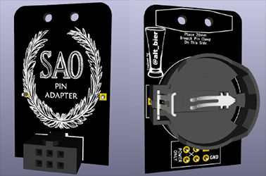
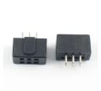
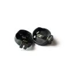
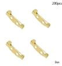
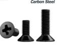
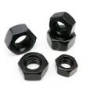

# SAO_Pin

Welcome to the SAO_Pin website.

The SAO_Pin is a simple adapter that will allow you to wear any badge Shitty Add On (SAO) as a broach pin instead of being attached to a badge or a totem.

The PCB is small at 25mm x 40mm, just large enough to hold its few components and hopefully small enough to be hidden behind any attached SAO.

The Gerber files have been made available [HERE](https://github.com/gowenrw/SAO_Pin/raw/refs/heads/master/eda/SAO_Pin/gerber/2025-06-03.zip) for anyone to use to order thier own PCBs.

Simply download the [ZIP file](https://github.com/gowenrw/SAO_Pin/raw/refs/heads/master/eda/SAO_Pin/gerber/2025-06-03.zip) and then choose your PCB manufacture to upload it to for ordering.

The design is simple, requiring only five components:

* SAO 2x3 keyed socket header, the type used on badges not the type used on SAO's.
  * 
* CR2032 Battery Holder with THT pins
  * 
* 20mm Brooch clip pin clasp with M2 sized screw holes for attachment
  * 
* M2 screws for attaching the pin.
  * 
* M2 nuts for attaching the pin.
  * 

Here are some links for ordering the components:

* SAO 2x3 keyed socket header, the type used on badges not the type used on SAO's.
  * https://www.aliexpress.us/item/2251832874579437.html
  * https://www.ebay.com/itm/173960769032

* CR2032 Battery Holder with THT pins
  * https://www.aliexpress.us/item/3256806213778380.html
  * https://www.amazon.com/dp/B07T3WP9T4

* 20mm Brooch clip pin clasp with M2 sized screw holes for attachment
  * https://www.aliexpress.us/item/2255800106050402.html - Choose the 2cm option
  * https://www.amazon.com/dp/B0BJJ4L94L - Choose the 20mm option

* M2 screws for attaching the pin.
  * https://www.aliexpress.us/item/3256808318392916.html - Choose M2 Screw 5mm Length
  * https://www.amazon.com/dp/B082XXXRV6 - Choose M2 Screw 5mm Length

* M2 nuts for attaching the pin.
  * https://www.aliexpress.us/item/3256806543218419.html - Choose M2 Nut
  * https://www.amazon.com/dp/B0CMG7Q27P - Choose M2 Nut

-- [@alt_bier](https://x.com/alt_bier)  - [My Contact Info](https://gowen.net/about)
